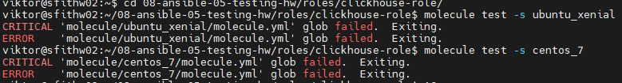
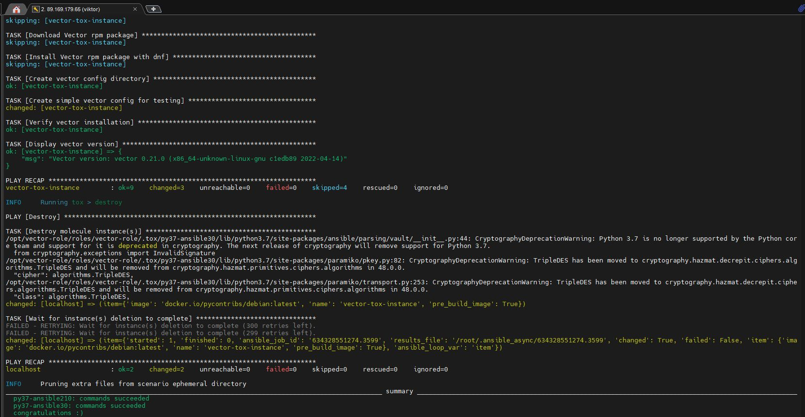

# Домашнее задание к занятию 5 «Тестирование roles» - Лебедев В.В. FOPS-33

## Подготовка к выполнению

1. Установите molecule и его драйвера: `pip3 install "molecule molecule_docker molecule_podman`.
2. Выполните `docker pull aragast/netology:latest` —  это образ с podman, tox и несколькими пайтонами (3.7 и 3.9) внутри.

## Основная часть

Ваша цель — настроить тестирование ваших ролей. 

Задача — сделать сценарии тестирования для vector. 

Ожидаемый результат — все сценарии успешно проходят тестирование ролей.

### Molecule

1. Запустите  `molecule test -s ubuntu_xenial` (или с любым другим сценарием, не имеет значения) внутри корневой директории clickhouse-role, посмотрите на вывод команды. Данная команда может отработать с ошибками или не отработать вовсе, это нормально. Наша цель - посмотреть как другие в реальном мире используют молекулу И из чего может состоять сценарий тестирования.
2. Перейдите в каталог с ролью vector-role и создайте сценарий тестирования по умолчанию при помощи `molecule init scenario --driver-name docker`.
3. Добавьте несколько разных дистрибутивов (oraclelinux:8, ubuntu:latest) для инстансов и протестируйте роль, исправьте найденные ошибки, если они есть.
4. Добавьте несколько assert в verify.yml-файл для  проверки работоспособности vector-role (проверка, что конфиг валидный, проверка успешности запуска и др.). 
5. Запустите тестирование роли повторно и проверьте, что оно прошло успешно.
5. Добавьте новый тег на коммит с рабочим сценарием в соответствии с семантическим версионированием.

### Решение Molecule

Получаем ошибку из за отсутствия сценариев

В новых версиях molecule драйвер не задается через экстра параметры в командной строке. Выполняем для инициализации
`molecule init scenario`

Добавляем в драйвер docker а в платформы несколько дистрибутивов
```yml 
# default/molecule.yml
---
dependency:
  name: galaxy
driver:
  name: docker
platforms:
  - name: ubuntu-vector
    image: docker.io/pycontribs/ubuntu:latest
    pre_build_image: true
  - name: centos-7-vector
    image: docker.io/pycontribs/centos:7
    pre_build_image: true
  - name: fedora-vector
    image: docker.io/pycontribs/fedora:latest
    pre_build_image: true
provisioner:
  name: ansible
  playbooks:
    converge: converge.yml
    verify: verify.yml
verifier:
  name: ansible
```

Добавляем assert'ы в файл проверок

```yml 
# default/verify.yml

---
- name: Verify
  hosts: all
  gather_facts: true
  tasks:
    - name: Check if vector is installed
      command: vector --version
      register: vector_version
      changed_when: false
      ignore_errors: yes

    - name: Display vector version
      debug:
        msg: "Vector version: {{ vector_version.stdout | default('Not installed') }}"

    - name: Verify vector installation
      assert:
        that:
          - vector_version.rc == 0
        msg: "Vector is not properly installed"
      ignore_errors: yes

    - name: Check vector config file
      stat:
        path: /etc/vector/vector.yaml
      register: config_file

    - name: Verify config file exists
      assert:
        that:
          - config_file.stat.exists
        msg: "Vector config file does not exist"

    - name: Validate vector config syntax
      command: vector validate --no-environment --config-yaml /etc/vector/vector.yaml
      register: config_validate
      changed_when: false
      ignore_errors: yes

    - name: Display validation result
      debug:
        msg: "Config validation: {{ 'OK' if config_validate.rc == 0 else 'FAILED' }}"

```

Выполняем `molecule test -s default`

<details>

<summary>результат выполнения команды: molecule test -s default </summary>

```shell 
INFO     default ➜ discovery: scenario test matrix: dependency, cleanup, destroy, syntax, create, prepare, converge, idempotence, side_effect, verify, cleanup, destroy
INFO     default ➜ prerun: Performing prerun with role_name_check=0...
INFO     default ➜ dependency: Executing
WARNING  default ➜ dependency: Missing roles requirements file: requirements.yml
WARNING  default ➜ dependency: Missing collections requirements file: collections.yml
WARNING  default ➜ dependency: Executed: 2 missing (Remove from test_sequence to suppress)
INFO     default ➜ cleanup: Executing
WARNING  default ➜ cleanup: Executed: Missing playbook (Remove from test_sequence to suppress)
INFO     default ➜ destroy: Executing
INFO     Sanity checks: 'docker'

PLAY [Destroy] *****************************************************************

TASK [Destroy molecule instance(s)] ********************************************
ok: [localhost] => (item={'image': 'docker.io/pycontribs/ubuntu:latest', 'name': 'ubuntu-vector', 'pre_build_image': True})
ok: [localhost] => (item={'image': 'docker.io/pycontribs/centos:7', 'name': 'centos-7-vector', 'pre_build_image': True})
ok: [localhost] => (item={'image': 'docker.io/pycontribs/fedora:latest', 'name': 'fedora-vector', 'pre_build_image': True})

PLAY RECAP *********************************************************************
localhost                  : ok=1    changed=0    unreachable=0    failed=0    skipped=0    rescued=0    ignored=0

INFO     default ➜ destroy: Executed: Successful
INFO     default ➜ syntax: Executing

playbook: /home/viktor/08-ansible-05-testing-hw/roles/vector-role/molecule/default/converge.yml
INFO     default ➜ syntax: Executed: Successful
INFO     default ➜ create: Executing

PLAY [Create] ******************************************************************

TASK [Set async_dir for HOME env] **********************************************
ok: [localhost]

TASK [Log into a Docker registry] **********************************************
skipping: [localhost] => (item=None)
skipping: [localhost] => (item=None)
skipping: [localhost] => (item=None)
skipping: [localhost]

TASK [Check presence of custom Dockerfiles] ************************************
ok: [localhost] => (item={'image': 'docker.io/pycontribs/ubuntu:latest', 'name': 'ubuntu-vector', 'pre_build_image': True})
ok: [localhost] => (item={'image': 'docker.io/pycontribs/centos:7', 'name': 'centos-7-vector', 'pre_build_image': True})
ok: [localhost] => (item={'image': 'docker.io/pycontribs/fedora:latest', 'name': 'fedora-vector', 'pre_build_image': True})

TASK [Create Dockerfiles from image names] *************************************
skipping: [localhost] => (item={'image': 'docker.io/pycontribs/ubuntu:latest', 'name': 'ubuntu-vector', 'pre_build_image': True})
skipping: [localhost] => (item={'image': 'docker.io/pycontribs/centos:7', 'name': 'centos-7-vector', 'pre_build_image': True})
skipping: [localhost] => (item={'image': 'docker.io/pycontribs/fedora:latest', 'name': 'fedora-vector', 'pre_build_image': True})
skipping: [localhost]

TASK [Synchronization the context] *********************************************
skipping: [localhost] => (item={'image': 'docker.io/pycontribs/ubuntu:latest', 'name': 'ubuntu-vector', 'pre_build_image': True})
skipping: [localhost] => (item={'image': 'docker.io/pycontribs/centos:7', 'name': 'centos-7-vector', 'pre_build_image': True})
skipping: [localhost] => (item={'image': 'docker.io/pycontribs/fedora:latest', 'name': 'fedora-vector', 'pre_build_image': True})
skipping: [localhost]

TASK [Discover local Docker images] ********************************************
ok: [localhost] => (item={'changed': False, 'skipped': True, 'skip_reason': 'Conditional result was False', 'false_condition': 'not item.pre_build_image | default(false)', 'item': {'image': 'docker.io/pycontribs/ubuntu:latest', 'name': 'ubuntu-vector', 'pre_build_image': True}, 'ansible_loop_var': 'item', 'i': 0, 'ansible_index_var': 'i'})
ok: [localhost] => (item={'changed': False, 'skipped': True, 'skip_reason': 'Conditional result was False', 'false_condition': 'not item.pre_build_image | default(false)', 'item': {'image': 'docker.io/pycontribs/centos:7', 'name': 'centos-7-vector', 'pre_build_image': True}, 'ansible_loop_var': 'item', 'i': 1, 'ansible_index_var': 'i'})
ok: [localhost] => (item={'changed': False, 'skipped': True, 'skip_reason': 'Conditional result was False', 'false_condition': 'not item.pre_build_image | default(false)', 'item': {'image': 'docker.io/pycontribs/fedora:latest', 'name': 'fedora-vector', 'pre_build_image': True}, 'ansible_loop_var': 'item', 'i': 2, 'ansible_index_var': 'i'})

TASK [Build an Ansible compatible image (new)] *********************************
skipping: [localhost] => (item=molecule_local/docker.io/pycontribs/ubuntu:latest)
skipping: [localhost] => (item=molecule_local/docker.io/pycontribs/centos:7)
skipping: [localhost] => (item=molecule_local/docker.io/pycontribs/fedora:latest)
skipping: [localhost]

TASK [Create docker network(s)] ************************************************
skipping: [localhost]

TASK [Determine the CMD directives] ********************************************
ok: [localhost] => (item={'image': 'docker.io/pycontribs/ubuntu:latest', 'name': 'ubuntu-vector', 'pre_build_image': True})
ok: [localhost] => (item={'image': 'docker.io/pycontribs/centos:7', 'name': 'centos-7-vector', 'pre_build_image': True})
ok: [localhost] => (item={'image': 'docker.io/pycontribs/fedora:latest', 'name': 'fedora-vector', 'pre_build_image': True})

TASK [Create molecule instance(s)] *********************************************
changed: [localhost] => (item=ubuntu-vector)
changed: [localhost] => (item=centos-7-vector)
changed: [localhost] => (item=fedora-vector)

TASK [Wait for instance(s) creation to complete] *******************************
FAILED - RETRYING: [localhost]: Wait for instance(s) creation to complete (300 retries left).
changed: [localhost] => (item={'failed': 0, 'started': 1, 'finished': 0, 'ansible_job_id': 'j587967282895.54092', 'results_file': '/home/viktor/.ansible_async/j587967282895.54092', 'changed': True, 'item': {'image': 'docker.io/pycontribs/ubuntu:latest', 'name': 'ubuntu-vector', 'pre_build_image': True}, 'ansible_loop_var': 'item'})
changed: [localhost] => (item={'failed': 0, 'started': 1, 'finished': 0, 'ansible_job_id': 'j991267067653.54117', 'results_file': '/home/viktor/.ansible_async/j991267067653.54117', 'changed': True, 'item': {'image': 'docker.io/pycontribs/centos:7', 'name': 'centos-7-vector', 'pre_build_image': True}, 'ansible_loop_var': 'item'})
changed: [localhost] => (item={'failed': 0, 'started': 1, 'finished': 0, 'ansible_job_id': 'j436313306975.54142', 'results_file': '/home/viktor/.ansible_async/j436313306975.54142', 'changed': True, 'item': {'image': 'docker.io/pycontribs/fedora:latest', 'name': 'fedora-vector', 'pre_build_image': True}, 'ansible_loop_var': 'item'})

PLAY RECAP *********************************************************************
localhost                  : ok=6    changed=2    unreachable=0    failed=0    skipped=5    rescued=0    ignored=0

INFO     default ➜ create: Executed: Successful
INFO     default ➜ prepare: Executing
WARNING  default ➜ prepare: Executed: Missing playbook (Remove from test_sequence to suppress)
INFO     default ➜ converge: Executing

PLAY [Converge] ****************************************************************

TASK [Gathering Facts] *********************************************************
ok: [fedora-vector]
ok: [ubuntu-vector]
ok: [centos-7-vector]

TASK [Include install tasks directly] ******************************************
included: /home/viktor/08-ansible-05-testing-hw/roles/vector-role/tasks/install_vector.yml for centos-7-vector, fedora-vector, ubuntu-vector

TASK [Get OS family] ***********************************************************
ok: [centos-7-vector] => {
    "ansible_os_family": "RedHat"
}
ok: [fedora-vector] => {
    "ansible_os_family": "RedHat"
}
ok: [ubuntu-vector] => {
    "ansible_os_family": "Debian"
}

TASK [Download Vector deb package] *********************************************
skipping: [centos-7-vector]
skipping: [fedora-vector]
changed: [ubuntu-vector]

TASK [Install Vector deb package] **********************************************
skipping: [centos-7-vector]
skipping: [fedora-vector]
changed: [ubuntu-vector]

TASK [Download Vector rpm package] *********************************************
skipping: [fedora-vector]
skipping: [ubuntu-vector]
changed: [centos-7-vector]

TASK [Install Vector rpm package] **********************************************
skipping: [fedora-vector]
skipping: [ubuntu-vector]
changed: [centos-7-vector]

TASK [Download Vector rpm package] *********************************************
skipping: [centos-7-vector]
skipping: [ubuntu-vector]
changed: [fedora-vector]

TASK [Install Vector rpm package with dnf] *************************************
skipping: [centos-7-vector]
skipping: [ubuntu-vector]
changed: [fedora-vector]

TASK [Create vector config directory] ******************************************
ok: [centos-7-vector]
ok: [ubuntu-vector]
ok: [fedora-vector]

TASK [Create simple vector config for testing] *********************************
changed: [centos-7-vector]
changed: [ubuntu-vector]
changed: [fedora-vector]

TASK [Verify vector installation] **********************************************
ok: [ubuntu-vector]
ok: [fedora-vector]
ok: [centos-7-vector]

TASK [Display vector version] **************************************************
ok: [centos-7-vector] => {
    "msg": "Vector version: vector 0.21.0 (x86_64-unknown-linux-gnu c1edb89 2022-04-14)"
}
ok: [fedora-vector] => {
    "msg": "Vector version: vector 0.21.0 (x86_64-unknown-linux-gnu c1edb89 2022-04-14)"
}
ok: [ubuntu-vector] => {
    "msg": "Vector version: vector 0.21.0 (x86_64-unknown-linux-gnu c1edb89 2022-04-14)"
}

PLAY RECAP *********************************************************************
centos-7-vector            : ok=9    changed=3    unreachable=0    failed=0    skipped=4    rescued=0    ignored=0
fedora-vector              : ok=9    changed=3    unreachable=0    failed=0    skipped=4    rescued=0    ignored=0
ubuntu-vector              : ok=9    changed=3    unreachable=0    failed=0    skipped=4    rescued=0    ignored=0

INFO     default ➜ converge: Executed: Successful
INFO     default ➜ idempotence: Executing

PLAY [Converge] ****************************************************************

TASK [Gathering Facts] *********************************************************
ok: [fedora-vector]
ok: [ubuntu-vector]
ok: [centos-7-vector]

TASK [Include install tasks directly] ******************************************
included: /home/viktor/08-ansible-05-testing-hw/roles/vector-role/tasks/install_vector.yml for centos-7-vector, fedora-vector, ubuntu-vector

TASK [Get OS family] ***********************************************************
ok: [centos-7-vector] => {
    "ansible_os_family": "RedHat"
}
ok: [fedora-vector] => {
    "ansible_os_family": "RedHat"
}
ok: [ubuntu-vector] => {
    "ansible_os_family": "Debian"
}

TASK [Download Vector deb package] *********************************************
skipping: [centos-7-vector]
skipping: [fedora-vector]
ok: [ubuntu-vector]

TASK [Install Vector deb package] **********************************************
skipping: [centos-7-vector]
skipping: [fedora-vector]
ok: [ubuntu-vector]

TASK [Download Vector rpm package] *********************************************
skipping: [fedora-vector]
skipping: [ubuntu-vector]
ok: [centos-7-vector]

TASK [Install Vector rpm package] **********************************************
skipping: [fedora-vector]
skipping: [ubuntu-vector]
ok: [centos-7-vector]

TASK [Download Vector rpm package] *********************************************
skipping: [centos-7-vector]
skipping: [ubuntu-vector]
ok: [fedora-vector]

TASK [Install Vector rpm package with dnf] *************************************
skipping: [centos-7-vector]
skipping: [ubuntu-vector]
ok: [fedora-vector]

TASK [Create vector config directory] ******************************************
ok: [centos-7-vector]
ok: [ubuntu-vector]
ok: [fedora-vector]

TASK [Create simple vector config for testing] *********************************
ok: [centos-7-vector]
ok: [fedora-vector]
ok: [ubuntu-vector]

TASK [Verify vector installation] **********************************************
ok: [ubuntu-vector]
ok: [fedora-vector]
ok: [centos-7-vector]

TASK [Display vector version] **************************************************
ok: [centos-7-vector] => {
    "msg": "Vector version: vector 0.21.0 (x86_64-unknown-linux-gnu c1edb89 2022-04-14)"
}
ok: [fedora-vector] => {
    "msg": "Vector version: vector 0.21.0 (x86_64-unknown-linux-gnu c1edb89 2022-04-14)"
}
ok: [ubuntu-vector] => {
    "msg": "Vector version: vector 0.21.0 (x86_64-unknown-linux-gnu c1edb89 2022-04-14)"
}

PLAY RECAP *********************************************************************
centos-7-vector            : ok=9    changed=0    unreachable=0    failed=0    skipped=4    rescued=0    ignored=0
fedora-vector              : ok=9    changed=0    unreachable=0    failed=0    skipped=4    rescued=0    ignored=0
ubuntu-vector              : ok=9    changed=0    unreachable=0    failed=0    skipped=4    rescued=0    ignored=0

INFO     default ➜ idempotence: Executed: Successful
INFO     default ➜ side_effect: Executing
WARNING  default ➜ side_effect: Executed: Missing playbook (Remove from test_sequence to suppress)
INFO     default ➜ verify: Executing

PLAY [Verify] ******************************************************************

TASK [Gathering Facts] *********************************************************
ok: [fedora-vector]
ok: [ubuntu-vector]
ok: [centos-7-vector]

TASK [Check if vector is installed] ********************************************
ok: [fedora-vector]
ok: [ubuntu-vector]
ok: [centos-7-vector]

TASK [Display vector version] **************************************************
ok: [centos-7-vector] => {
    "msg": "Vector version: vector 0.21.0 (x86_64-unknown-linux-gnu c1edb89 2022-04-14)"
}
ok: [fedora-vector] => {
    "msg": "Vector version: vector 0.21.0 (x86_64-unknown-linux-gnu c1edb89 2022-04-14)"
}
ok: [ubuntu-vector] => {
    "msg": "Vector version: vector 0.21.0 (x86_64-unknown-linux-gnu c1edb89 2022-04-14)"
}

TASK [Verify vector installation] **********************************************
ok: [centos-7-vector] => {
    "changed": false,
    "msg": "All assertions passed"
}
ok: [fedora-vector] => {
    "changed": false,
    "msg": "All assertions passed"
}
ok: [ubuntu-vector] => {
    "changed": false,
    "msg": "All assertions passed"
}

TASK [Check vector config file] ************************************************
ok: [centos-7-vector]
ok: [ubuntu-vector]
ok: [fedora-vector]

TASK [Verify config file exists] ***********************************************
ok: [centos-7-vector] => {
    "changed": false,
    "msg": "All assertions passed"
}
ok: [fedora-vector] => {
    "changed": false,
    "msg": "All assertions passed"
}
ok: [ubuntu-vector] => {
    "changed": false,
    "msg": "All assertions passed"
}

TASK [Validate vector config syntax] *******************************************
ok: [ubuntu-vector]
ok: [fedora-vector]
ok: [centos-7-vector]

TASK [Display validation result] ***********************************************
ok: [centos-7-vector] => {
    "msg": "Config validation: OK"
}
ok: [fedora-vector] => {
    "msg": "Config validation: OK"
}
ok: [ubuntu-vector] => {
    "msg": "Config validation: OK"
}

PLAY RECAP *********************************************************************
centos-7-vector            : ok=8    changed=0    unreachable=0    failed=0    skipped=0    rescued=0    ignored=0
fedora-vector              : ok=8    changed=0    unreachable=0    failed=0    skipped=0    rescued=0    ignored=0
ubuntu-vector              : ok=8    changed=0    unreachable=0    failed=0    skipped=0    rescued=0    ignored=0

INFO     default ➜ verify: Executed: Successful
INFO     default ➜ cleanup: Executing
WARNING  default ➜ cleanup: Executed: Missing playbook (Remove from test_sequence to suppress)
INFO     default ➜ destroy: Executing

PLAY [Destroy] *****************************************************************

TASK [Destroy molecule instance(s)] ********************************************
changed: [localhost] => (item={'image': 'docker.io/pycontribs/ubuntu:latest', 'name': 'ubuntu-vector', 'pre_build_image': True})
changed: [localhost] => (item={'image': 'docker.io/pycontribs/centos:7', 'name': 'centos-7-vector', 'pre_build_image': True})
changed: [localhost] => (item={'image': 'docker.io/pycontribs/fedora:latest', 'name': 'fedora-vector', 'pre_build_image': True})

PLAY RECAP *********************************************************************
localhost                  : ok=1    changed=1    unreachable=0    failed=0    skipped=0    rescued=0    ignored=0

INFO     default ➜ destroy: Executed: Successful
INFO     default ➜ scenario: Pruning extra files from scenario ephemeral directory
WARNING  Molecule executed 1 scenario (1 missing files)

```
</details>  

### Tox

1. Добавьте в директорию с vector-role файлы из [директории](./example).
2. Запустите `docker run --privileged=True -v <path_to_repo>:/opt/vector-role -w /opt/vector-role -it aragast/netology:latest /bin/bash`, где path_to_repo — путь до корня репозитория с vector-role на вашей файловой системе.
3. Внутри контейнера выполните команду `tox`, посмотрите на вывод.
5. Создайте облегчённый сценарий для `molecule` с драйвером `molecule_podman`. Проверьте его на исполнимость.
6. Пропишите правильную команду в `tox.ini`, чтобы запускался облегчённый сценарий.
8. Запустите команду `tox`. Убедитесь, что всё отработало успешно.
9. Добавьте новый тег на коммит с рабочим сценарием в соответствии с семантическим версионированием.

После выполнения у вас должно получится два сценария molecule и один tox.ini файл в репозитории. Не забудьте указать в ответе теги решений Tox и Molecule заданий. В качестве решения пришлите ссылку на  ваш репозиторий и скриншоты этапов выполнения задания. 

### Решение Tox

Добавили файлы. Запустили контейнер и команду tox в нем. Вывод

<details>

<summary>результат выполнения команды tox как есть</summary>

```shell
[root@fdb585299239 vector-role]# tox
py37-ansible29 recreate: /opt/vector-role/roles/vector-role/.tox/py37-ansible29
py37-ansible29 installdeps: -rtox-requirements.txt, ansible>=2.9,<2.10, molecule<4.0, molecule-podman<2.0
py37-ansible29 installed: ansible==2.9.27,ansible-compat==1.0.0,arrow==1.2.3,bcrypt==4.2.1,binaryornot==0.4.4,cached-property==1.5.2,Cerberus==1.3.8,certifi==2026.1.4,cffi==1.15.1,chardet==5.2.0,charset-normalizer==3.4.4,click==8.1.8,click-help-colors==0.9.4,cookiecutter==2.6.0,cryptography==45.0.7,distro==1.9.0,enrich==1.2.7,idna==3.10,importlib-metadata==6.7.0,Jinja2==3.1.6,jmespath==1.0.1,lxml==5.4.0,markdown-it-py==2.2.0,MarkupSafe==2.1.5,mdurl==0.1.2,molecule==3.6.1,molecule-podman==1.1.0,packaging==24.0,paramiko==2.12.0,pluggy==1.2.0,pycparser==2.21,Pygments==2.17.2,PyNaCl==1.5.0,python-dateutil==2.9.0.post0,python-slugify==8.0.4,PyYAML==6.0.1,requests==2.31.0,rich==13.8.1,selinux==0.2.1,six==1.17.0,subprocess-tee==0.3.5,text-unidecode==1.3,typing_extensions==4.7.1,urllib3==2.0.7,zipp==3.15.0
py37-ansible29 run-test-pre: PYTHONHASHSEED='2827323557'
py37-ansible29 run-test: commands[0] | molecule test -s compatibility --destroy always
/opt/vector-role/roles/vector-role/.tox/py37-ansible29/lib/python3.7/site-packages/ansible/parsing/vault/__init__.py:44: CryptographyDeprecationWarning: Python 3.7 is no longer supported by the Python core team and support for it is deprecated in cryptography. The next release of cryptography will remove support for Python 3.7.
  from cryptography.exceptions import InvalidSignature
CRITICAL 'molecule/compatibility/molecule.yml' glob failed.  Exiting.
ERROR: InvocationError for command /opt/vector-role/roles/vector-role/.tox/py37-ansible29/bin/molecule test -s compatibility --destroy always (exited with code 1)
_________________________________________________________________________________________________ summary __________________________________________________________________________________________________
ERROR:   py37-ansible29: commands failed
[root@fdb585299239 vector-role]# 
```
</details>
Возникает ожидаемая ошибка CRITICAL 'molecule/compatibility/molecule.yml' glob failed - это нормально для промежуточного этапа, так как сценарий compatibility еще не создан

Создаем облегчённый сценарий для molecule с драйвером podman
Файл `molecule/tox/molecule.yml`
```yml 
---
dependency:
  name: galaxy
driver:
  name: podman
platforms:
  - name: vector-tox-instance
    image: docker.io/pycontribs/debian:latest
    pre_build_image: true
provisioner:
  name: ansible
  playbooks:
    converge: ../default/converge.yml
verifier:
  name: ansible
scenario:
  name: tox
  test_sequence:
    - destroy
    - create
    - converge
    - destroy
```

Рабочий файл `tox.ini`
```ini 
[tox]
minversion = 1.8
basepython = python3.6
envlist = py37-ansible210, py37-ansible30
skipsdist = true

[testenv]
passenv = *
deps =
  -r tox-requirements.txt
  ansible210: ansible<3.0
  ansible30: ansible<3.1
commands =
  {posargs:molecule test -s tox --destroy always}
```

Рабочий файл `tox-requirements.txt`
```text
selinux
lxml
molecule
molecule_podman
jmespath
```

<details>
<summary>полый результат выполнения tox</summary>
```shell
[root@65dbc58a2b5d vector-role]# tox
py37-ansible210 create: /opt/vector-role/roles/vector-role/.tox/py37-ansible210
py37-ansible210 installdeps: -rtox-requirements.txt, ansible<3.0
py37-ansible210 installed: ansible==2.10.7,ansible-base==2.10.17,ansible-compat==1.0.0,arrow==1.2.3,bcrypt==4.2.1,binaryornot==0.4.4,cached-property==1.5.2,Cerberus==1.3.8,certifi==2026.1.4,cffi==1.15.1,chardet==5.2.0,charset-normalizer==3.4.4,click==8.1.8,click-help-colors==0.9.4,cookiecutter==2.6.0,cryptography==45.0.7,distro==1.9.0,enrich==1.2.7,idna==3.10,importlib-metadata==6.7.0,Jinja2==3.1.6,jmespath==1.0.1,lxml==5.4.0,markdown-it-py==2.2.0,MarkupSafe==2.1.5,mdurl==0.1.2,molecule==3.6.1,molecule-podman==1.1.0,packaging==24.0,paramiko==2.12.0,pluggy==1.2.0,pycparser==2.21,Pygments==2.17.2,PyNaCl==1.5.0,python-dateutil==2.9.0.post0,python-slugify==8.0.4,PyYAML==6.0.1,requests==2.31.0,rich==13.8.1,selinux==0.2.1,six==1.17.0,subprocess-tee==0.3.5,text-unidecode==1.3,typing_extensions==4.7.1,urllib3==2.0.7,zipp==3.15.0
py37-ansible210 run-test-pre: PYTHONHASHSEED='2813447495'
py37-ansible210 run-test: commands[0] | molecule test -s tox --destroy always
/opt/vector-role/roles/vector-role/.tox/py37-ansible210/lib/python3.7/site-packages/ansible/parsing/vault/__init__.py:44: CryptographyDeprecationWarning: Python 3.7 is no longer supported by the Python core team and support for it is deprecated in cryptography. The next release of cryptography will remove support for Python 3.7.
  from cryptography.exceptions import InvalidSignature
INFO     tox scenario test matrix: destroy, create, converge, destroy
INFO     Performing prerun...
INFO     Set ANSIBLE_LIBRARY=/root/.cache/ansible-compat/63c5a9/modules:/root/.ansible/plugins/modules:/usr/share/ansible/plugins/modules
INFO     Set ANSIBLE_COLLECTIONS_PATH=/root/.cache/ansible-compat/63c5a9/collections:/root/.ansible/collections:/usr/share/ansible/collections
INFO     Set ANSIBLE_ROLES_PATH=/root/.cache/ansible-compat/63c5a9/roles:/root/.ansible/roles:/usr/share/ansible/roles:/etc/ansible/roles
INFO     Using /root/.ansible/roles/yc.vector symlink to current repository in order to enable Ansible to find the role using its expected full name.
INFO     Running tox > destroy
INFO     Sanity checks: 'podman'
/opt/vector-role/roles/vector-role/.tox/py37-ansible210/lib/python3.7/site-packages/ansible/parsing/vault/__init__.py:44: CryptographyDeprecationWarning: Python 3.7 is no longer supported by the Python core team and support for it is deprecated in cryptography. The next release of cryptography will remove support for Python 3.7.
  from cryptography.exceptions import InvalidSignature

PLAY [Destroy] *****************************************************************

TASK [Destroy molecule instance(s)] ********************************************
/opt/vector-role/roles/vector-role/.tox/py37-ansible210/lib/python3.7/site-packages/ansible/parsing/vault/__init__.py:44: CryptographyDeprecationWarning: Python 3.7 is no longer supported by the Python core team and support for it is deprecated in cryptography. The next release of cryptography will remove support for Python 3.7.
  from cryptography.exceptions import InvalidSignature
/opt/vector-role/roles/vector-role/.tox/py37-ansible210/lib/python3.7/site-packages/paramiko/pkey.py:82: CryptographyDeprecationWarning: TripleDES has been moved to cryptography.hazmat.decrepit.ciphers.algorithms.TripleDES and will be removed from cryptography.hazmat.primitives.ciphers.algorithms in 48.0.0.
  "cipher": algorithms.TripleDES,
/opt/vector-role/roles/vector-role/.tox/py37-ansible210/lib/python3.7/site-packages/paramiko/transport.py:253: CryptographyDeprecationWarning: TripleDES has been moved to cryptography.hazmat.decrepit.ciphers.algorithms.TripleDES and will be removed from cryptography.hazmat.primitives.ciphers.algorithms in 48.0.0.
  "class": algorithms.TripleDES,
changed: [localhost] => (item={'image': 'docker.io/pycontribs/debian:latest', 'name': 'vector-tox-instance', 'pre_build_image': True})

TASK [Wait for instance(s) deletion to complete] *******************************
changed: [localhost] => (item={'started': 1, 'finished': 0, 'ansible_job_id': '730409867722.353', 'results_file': '/root/.ansible_async/730409867722.353', 'changed': True, 'failed': False, 'item': {'image': 'docker.io/pycontribs/debian:latest', 'name': 'vector-tox-instance', 'pre_build_image': True}, 'ansible_loop_var': 'item'})

PLAY RECAP *********************************************************************
localhost                  : ok=2    changed=2    unreachable=0    failed=0    skipped=0    rescued=0    ignored=0

INFO     Running tox > create

PLAY [Create] ******************************************************************

TASK [get podman executable path] **********************************************
/opt/vector-role/roles/vector-role/.tox/py37-ansible210/lib/python3.7/site-packages/ansible/parsing/vault/__init__.py:44: CryptographyDeprecationWarning: Python 3.7 is no longer supported by the Python core team and support for it is deprecated in cryptography. The next release of cryptography will remove support for Python 3.7.
  from cryptography.exceptions import InvalidSignature
/opt/vector-role/roles/vector-role/.tox/py37-ansible210/lib/python3.7/site-packages/paramiko/pkey.py:82: CryptographyDeprecationWarning: TripleDES has been moved to cryptography.hazmat.decrepit.ciphers.algorithms.TripleDES and will be removed from cryptography.hazmat.primitives.ciphers.algorithms in 48.0.0.
  "cipher": algorithms.TripleDES,
/opt/vector-role/roles/vector-role/.tox/py37-ansible210/lib/python3.7/site-packages/paramiko/transport.py:253: CryptographyDeprecationWarning: TripleDES has been moved to cryptography.hazmat.decrepit.ciphers.algorithms.TripleDES and will be removed from cryptography.hazmat.primitives.ciphers.algorithms in 48.0.0.
  "class": algorithms.TripleDES,
ok: [localhost]

TASK [save path to executable as fact] *****************************************
ok: [localhost]

TASK [Log into a container registry] *******************************************
skipping: [localhost] => (item="vector-tox-instance registry username: None specified")

TASK [Check presence of custom Dockerfiles] ************************************
ok: [localhost] => (item=Dockerfile: None specified)

TASK [Create Dockerfiles from image names] *************************************
skipping: [localhost] => (item="Dockerfile: None specified; Image: docker.io/pycontribs/debian:latest")

TASK [Discover local Podman images] ********************************************
ok: [localhost] => (item=vector-tox-instance)

TASK [Build an Ansible compatible image] ***************************************
skipping: [localhost] => (item=docker.io/pycontribs/debian:latest)

TASK [Determine the CMD directives] ********************************************
ok: [localhost] => (item="vector-tox-instance command: None specified")

TASK [Remove possible pre-existing containers] *********************************
changed: [localhost]

TASK [Discover local podman networks] ******************************************
skipping: [localhost] => (item=vector-tox-instance: None specified)

TASK [Create podman network dedicated to this scenario] ************************
skipping: [localhost]

TASK [Create molecule instance(s)] *********************************************
changed: [localhost] => (item=vector-tox-instance)

TASK [Wait for instance(s) creation to complete] *******************************
FAILED - RETRYING: Wait for instance(s) creation to complete (300 retries left).
FAILED - RETRYING: Wait for instance(s) creation to complete (299 retries left).
FAILED - RETRYING: Wait for instance(s) creation to complete (298 retries left).
FAILED - RETRYING: Wait for instance(s) creation to complete (297 retries left).
FAILED - RETRYING: Wait for instance(s) creation to complete (296 retries left).
changed: [localhost] => (item=vector-tox-instance)

PLAY RECAP *********************************************************************
localhost                  : ok=8    changed=3    unreachable=0    failed=0    skipped=5    rescued=0    ignored=0

INFO     Running tox > converge

PLAY [Converge] ****************************************************************

TASK [Gathering Facts] *********************************************************
/opt/vector-role/roles/vector-role/.tox/py37-ansible210/lib/python3.7/site-packages/ansible/parsing/vault/__init__.py:44: CryptographyDeprecationWarning: Python 3.7 is no longer supported by the Python core team and support for it is deprecated in cryptography. The next release of cryptography will remove support for Python 3.7.
  from cryptography.exceptions import InvalidSignature
/opt/vector-role/roles/vector-role/.tox/py37-ansible210/lib/python3.7/site-packages/paramiko/pkey.py:82: CryptographyDeprecationWarning: TripleDES has been moved to cryptography.hazmat.decrepit.ciphers.algorithms.TripleDES and will be removed from cryptography.hazmat.primitives.ciphers.algorithms in 48.0.0.
  "cipher": algorithms.TripleDES,
/opt/vector-role/roles/vector-role/.tox/py37-ansible210/lib/python3.7/site-packages/paramiko/transport.py:253: CryptographyDeprecationWarning: TripleDES has been moved to cryptography.hazmat.decrepit.ciphers.algorithms.TripleDES and will be removed from cryptography.hazmat.primitives.ciphers.algorithms in 48.0.0.
  "class": algorithms.TripleDES,
ok: [vector-tox-instance]

TASK [Include install tasks directly] ******************************************
included: /opt/vector-role/roles/vector-role/tasks/install_vector.yml for vector-tox-instance

TASK [Get OS family] ***********************************************************
ok: [vector-tox-instance] => {
    "ansible_os_family": "Debian"
}

TASK [Download Vector deb package] *********************************************
changed: [vector-tox-instance]

TASK [Install Vector deb package] **********************************************
changed: [vector-tox-instance]

TASK [Download Vector rpm package] *********************************************
skipping: [vector-tox-instance]

TASK [Install Vector rpm package] **********************************************
skipping: [vector-tox-instance]

TASK [Download Vector rpm package] *********************************************
skipping: [vector-tox-instance]

TASK [Install Vector rpm package with dnf] *************************************
skipping: [vector-tox-instance]

TASK [Create vector config directory] ******************************************
ok: [vector-tox-instance]

TASK [Create simple vector config for testing] *********************************
changed: [vector-tox-instance]

TASK [Verify vector installation] **********************************************
ok: [vector-tox-instance]

TASK [Display vector version] **************************************************
ok: [vector-tox-instance] => {
    "msg": "Vector version: vector 0.21.0 (x86_64-unknown-linux-gnu c1edb89 2022-04-14)"
}

PLAY RECAP *********************************************************************
vector-tox-instance        : ok=9    changed=3    unreachable=0    failed=0    skipped=4    rescued=0    ignored=0

INFO     Running tox > destroy

PLAY [Destroy] *****************************************************************

TASK [Destroy molecule instance(s)] ********************************************
/opt/vector-role/roles/vector-role/.tox/py37-ansible210/lib/python3.7/site-packages/ansible/parsing/vault/__init__.py:44: CryptographyDeprecationWarning: Python 3.7 is no longer supported by the Python core team and support for it is deprecated in cryptography. The next release of cryptography will remove support for Python 3.7.
  from cryptography.exceptions import InvalidSignature
/opt/vector-role/roles/vector-role/.tox/py37-ansible210/lib/python3.7/site-packages/paramiko/pkey.py:82: CryptographyDeprecationWarning: TripleDES has been moved to cryptography.hazmat.decrepit.ciphers.algorithms.TripleDES and will be removed from cryptography.hazmat.primitives.ciphers.algorithms in 48.0.0.
  "cipher": algorithms.TripleDES,
/opt/vector-role/roles/vector-role/.tox/py37-ansible210/lib/python3.7/site-packages/paramiko/transport.py:253: CryptographyDeprecationWarning: TripleDES has been moved to cryptography.hazmat.decrepit.ciphers.algorithms.TripleDES and will be removed from cryptography.hazmat.primitives.ciphers.algorithms in 48.0.0.
  "class": algorithms.TripleDES,
changed: [localhost] => (item={'image': 'docker.io/pycontribs/debian:latest', 'name': 'vector-tox-instance', 'pre_build_image': True})

TASK [Wait for instance(s) deletion to complete] *******************************
FAILED - RETRYING: Wait for instance(s) deletion to complete (300 retries left).
FAILED - RETRYING: Wait for instance(s) deletion to complete (299 retries left).
changed: [localhost] => (item={'started': 1, 'finished': 0, 'ansible_job_id': '645594504565.1938', 'results_file': '/root/.ansible_async/645594504565.1938', 'changed': True, 'failed': False, 'item': {'image': 'docker.io/pycontribs/debian:latest', 'name': 'vector-tox-instance', 'pre_build_image': True}, 'ansible_loop_var': 'item'})

PLAY RECAP *********************************************************************
localhost                  : ok=2    changed=2    unreachable=0    failed=0    skipped=0    rescued=0    ignored=0

INFO     Pruning extra files from scenario ephemeral directory
py37-ansible30 create: /opt/vector-role/roles/vector-role/.tox/py37-ansible30
py37-ansible30 installdeps: -rtox-requirements.txt, ansible<3.1
py37-ansible30 installed: ansible==3.0.0,ansible-base==2.10.17,ansible-compat==1.0.0,arrow==1.2.3,bcrypt==4.2.1,binaryornot==0.4.4,cached-property==1.5.2,Cerberus==1.3.8,certifi==2026.1.4,cffi==1.15.1,chardet==5.2.0,charset-normalizer==3.4.4,click==8.1.8,click-help-colors==0.9.4,cookiecutter==2.6.0,cryptography==45.0.7,distro==1.9.0,enrich==1.2.7,idna==3.10,importlib-metadata==6.7.0,Jinja2==3.1.6,jmespath==1.0.1,lxml==5.4.0,markdown-it-py==2.2.0,MarkupSafe==2.1.5,mdurl==0.1.2,molecule==3.6.1,molecule-podman==1.1.0,packaging==24.0,paramiko==2.12.0,pluggy==1.2.0,pycparser==2.21,Pygments==2.17.2,PyNaCl==1.5.0,python-dateutil==2.9.0.post0,python-slugify==8.0.4,PyYAML==6.0.1,requests==2.31.0,rich==13.8.1,selinux==0.2.1,six==1.17.0,subprocess-tee==0.3.5,text-unidecode==1.3,typing_extensions==4.7.1,urllib3==2.0.7,zipp==3.15.0
py37-ansible30 run-test-pre: PYTHONHASHSEED='2813447495'
py37-ansible30 run-test: commands[0] | molecule test -s tox --destroy always
/opt/vector-role/roles/vector-role/.tox/py37-ansible30/lib/python3.7/site-packages/ansible/parsing/vault/__init__.py:44: CryptographyDeprecationWarning: Python 3.7 is no longer supported by the Python core team and support for it is deprecated in cryptography. The next release of cryptography will remove support for Python 3.7.
  from cryptography.exceptions import InvalidSignature
INFO     tox scenario test matrix: destroy, create, converge, destroy
INFO     Performing prerun...
INFO     Set ANSIBLE_LIBRARY=/root/.cache/ansible-compat/63c5a9/modules:/root/.ansible/plugins/modules:/usr/share/ansible/plugins/modules
INFO     Set ANSIBLE_COLLECTIONS_PATH=/root/.cache/ansible-compat/63c5a9/collections:/root/.ansible/collections:/usr/share/ansible/collections
INFO     Set ANSIBLE_ROLES_PATH=/root/.cache/ansible-compat/63c5a9/roles:/root/.ansible/roles:/usr/share/ansible/roles:/etc/ansible/roles
INFO     Using /root/.ansible/roles/yc.vector symlink to current repository in order to enable Ansible to find the role using its expected full name.
INFO     Running tox > destroy
INFO     Sanity checks: 'podman'
/opt/vector-role/roles/vector-role/.tox/py37-ansible30/lib/python3.7/site-packages/ansible/parsing/vault/__init__.py:44: CryptographyDeprecationWarning: Python 3.7 is no longer supported by the Python core team and support for it is deprecated in cryptography. The next release of cryptography will remove support for Python 3.7.
  from cryptography.exceptions import InvalidSignature

PLAY [Destroy] *****************************************************************

TASK [Destroy molecule instance(s)] ********************************************
/opt/vector-role/roles/vector-role/.tox/py37-ansible30/lib/python3.7/site-packages/ansible/parsing/vault/__init__.py:44: CryptographyDeprecationWarning: Python 3.7 is no longer supported by the Python core team and support for it is deprecated in cryptography. The next release of cryptography will remove support for Python 3.7.
  from cryptography.exceptions import InvalidSignature
/opt/vector-role/roles/vector-role/.tox/py37-ansible30/lib/python3.7/site-packages/paramiko/pkey.py:82: CryptographyDeprecationWarning: TripleDES has been moved to cryptography.hazmat.decrepit.ciphers.algorithms.TripleDES and will be removed from cryptography.hazmat.primitives.ciphers.algorithms in 48.0.0.
  "cipher": algorithms.TripleDES,
/opt/vector-role/roles/vector-role/.tox/py37-ansible30/lib/python3.7/site-packages/paramiko/transport.py:253: CryptographyDeprecationWarning: TripleDES has been moved to cryptography.hazmat.decrepit.ciphers.algorithms.TripleDES and will be removed from cryptography.hazmat.primitives.ciphers.algorithms in 48.0.0.
  "class": algorithms.TripleDES,
changed: [localhost] => (item={'image': 'docker.io/pycontribs/debian:latest', 'name': 'vector-tox-instance', 'pre_build_image': True})

TASK [Wait for instance(s) deletion to complete] *******************************
changed: [localhost] => (item={'started': 1, 'finished': 0, 'ansible_job_id': '636262128288.2098', 'results_file': '/root/.ansible_async/636262128288.2098', 'changed': True, 'failed': False, 'item': {'image': 'docker.io/pycontribs/debian:latest', 'name': 'vector-tox-instance', 'pre_build_image': True}, 'ansible_loop_var': 'item'})

PLAY RECAP *********************************************************************
localhost                  : ok=2    changed=2    unreachable=0    failed=0    skipped=0    rescued=0    ignored=0

INFO     Running tox > create

PLAY [Create] ******************************************************************

TASK [get podman executable path] **********************************************
/opt/vector-role/roles/vector-role/.tox/py37-ansible30/lib/python3.7/site-packages/ansible/parsing/vault/__init__.py:44: CryptographyDeprecationWarning: Python 3.7 is no longer supported by the Python core team and support for it is deprecated in cryptography. The next release of cryptography will remove support for Python 3.7.
  from cryptography.exceptions import InvalidSignature
/opt/vector-role/roles/vector-role/.tox/py37-ansible30/lib/python3.7/site-packages/paramiko/pkey.py:82: CryptographyDeprecationWarning: TripleDES has been moved to cryptography.hazmat.decrepit.ciphers.algorithms.TripleDES and will be removed from cryptography.hazmat.primitives.ciphers.algorithms in 48.0.0.
  "cipher": algorithms.TripleDES,
/opt/vector-role/roles/vector-role/.tox/py37-ansible30/lib/python3.7/site-packages/paramiko/transport.py:253: CryptographyDeprecationWarning: TripleDES has been moved to cryptography.hazmat.decrepit.ciphers.algorithms.TripleDES and will be removed from cryptography.hazmat.primitives.ciphers.algorithms in 48.0.0.
  "class": algorithms.TripleDES,
ok: [localhost]

TASK [save path to executable as fact] *****************************************
ok: [localhost]

TASK [Log into a container registry] *******************************************
skipping: [localhost] => (item="vector-tox-instance registry username: None specified")

TASK [Check presence of custom Dockerfiles] ************************************
ok: [localhost] => (item=Dockerfile: None specified)

TASK [Create Dockerfiles from image names] *************************************
skipping: [localhost] => (item="Dockerfile: None specified; Image: docker.io/pycontribs/debian:latest")

TASK [Discover local Podman images] ********************************************
ok: [localhost] => (item=vector-tox-instance)

TASK [Build an Ansible compatible image] ***************************************
skipping: [localhost] => (item=docker.io/pycontribs/debian:latest)

TASK [Determine the CMD directives] ********************************************
ok: [localhost] => (item="vector-tox-instance command: None specified")

TASK [Remove possible pre-existing containers] *********************************
changed: [localhost]

TASK [Discover local podman networks] ******************************************
skipping: [localhost] => (item=vector-tox-instance: None specified)

TASK [Create podman network dedicated to this scenario] ************************
skipping: [localhost]

TASK [Create molecule instance(s)] *********************************************
changed: [localhost] => (item=vector-tox-instance)

TASK [Wait for instance(s) creation to complete] *******************************
FAILED - RETRYING: Wait for instance(s) creation to complete (300 retries left).
changed: [localhost] => (item=vector-tox-instance)

PLAY RECAP *********************************************************************
localhost                  : ok=8    changed=3    unreachable=0    failed=0    skipped=5    rescued=0    ignored=0

INFO     Running tox > converge

PLAY [Converge] ****************************************************************

TASK [Gathering Facts] *********************************************************
/opt/vector-role/roles/vector-role/.tox/py37-ansible30/lib/python3.7/site-packages/ansible/parsing/vault/__init__.py:44: CryptographyDeprecationWarning: Python 3.7 is no longer supported by the Python core team and support for it is deprecated in cryptography. The next release of cryptography will remove support for Python 3.7.
  from cryptography.exceptions import InvalidSignature
/opt/vector-role/roles/vector-role/.tox/py37-ansible30/lib/python3.7/site-packages/paramiko/pkey.py:82: CryptographyDeprecationWarning: TripleDES has been moved to cryptography.hazmat.decrepit.ciphers.algorithms.TripleDES and will be removed from cryptography.hazmat.primitives.ciphers.algorithms in 48.0.0.
  "cipher": algorithms.TripleDES,
/opt/vector-role/roles/vector-role/.tox/py37-ansible30/lib/python3.7/site-packages/paramiko/transport.py:253: CryptographyDeprecationWarning: TripleDES has been moved to cryptography.hazmat.decrepit.ciphers.algorithms.TripleDES and will be removed from cryptography.hazmat.primitives.ciphers.algorithms in 48.0.0.
  "class": algorithms.TripleDES,
ok: [vector-tox-instance]

TASK [Include install tasks directly] ******************************************
included: /opt/vector-role/roles/vector-role/tasks/install_vector.yml for vector-tox-instance

TASK [Get OS family] ***********************************************************
ok: [vector-tox-instance] => {
    "ansible_os_family": "Debian"
}

TASK [Download Vector deb package] *********************************************
changed: [vector-tox-instance]

TASK [Install Vector deb package] **********************************************
changed: [vector-tox-instance]

TASK [Download Vector rpm package] *********************************************
skipping: [vector-tox-instance]

TASK [Install Vector rpm package] **********************************************
skipping: [vector-tox-instance]

TASK [Download Vector rpm package] *********************************************
skipping: [vector-tox-instance]

TASK [Install Vector rpm package with dnf] *************************************
skipping: [vector-tox-instance]

TASK [Create vector config directory] ******************************************
ok: [vector-tox-instance]

TASK [Create simple vector config for testing] *********************************
changed: [vector-tox-instance]

TASK [Verify vector installation] **********************************************
ok: [vector-tox-instance]

TASK [Display vector version] **************************************************
ok: [vector-tox-instance] => {
    "msg": "Vector version: vector 0.21.0 (x86_64-unknown-linux-gnu c1edb89 2022-04-14)"
}

PLAY RECAP *********************************************************************
vector-tox-instance        : ok=9    changed=3    unreachable=0    failed=0    skipped=4    rescued=0    ignored=0

INFO     Running tox > destroy

PLAY [Destroy] *****************************************************************

TASK [Destroy molecule instance(s)] ********************************************
/opt/vector-role/roles/vector-role/.tox/py37-ansible30/lib/python3.7/site-packages/ansible/parsing/vault/__init__.py:44: CryptographyDeprecationWarning: Python 3.7 is no longer supported by the Python core team and support for it is deprecated in cryptography. The next release of cryptography will remove support for Python 3.7.
  from cryptography.exceptions import InvalidSignature
/opt/vector-role/roles/vector-role/.tox/py37-ansible30/lib/python3.7/site-packages/paramiko/pkey.py:82: CryptographyDeprecationWarning: TripleDES has been moved to cryptography.hazmat.decrepit.ciphers.algorithms.TripleDES and will be removed from cryptography.hazmat.primitives.ciphers.algorithms in 48.0.0.
  "cipher": algorithms.TripleDES,
/opt/vector-role/roles/vector-role/.tox/py37-ansible30/lib/python3.7/site-packages/paramiko/transport.py:253: CryptographyDeprecationWarning: TripleDES has been moved to cryptography.hazmat.decrepit.ciphers.algorithms.TripleDES and will be removed from cryptography.hazmat.primitives.ciphers.algorithms in 48.0.0.
  "class": algorithms.TripleDES,
changed: [localhost] => (item={'image': 'docker.io/pycontribs/debian:latest', 'name': 'vector-tox-instance', 'pre_build_image': True})

TASK [Wait for instance(s) deletion to complete] *******************************
FAILED - RETRYING: Wait for instance(s) deletion to complete (300 retries left).
FAILED - RETRYING: Wait for instance(s) deletion to complete (299 retries left).
changed: [localhost] => (item={'started': 1, 'finished': 0, 'ansible_job_id': '634328551274.3599', 'results_file': '/root/.ansible_async/634328551274.3599', 'changed': True, 'failed': False, 'item': {'image': 'docker.io/pycontribs/debian:latest', 'name': 'vector-tox-instance', 'pre_build_image': True}, 'ansible_loop_var': 'item'})

PLAY RECAP *********************************************************************
localhost                  : ok=2    changed=2    unreachable=0    failed=0    skipped=0    rescued=0    ignored=0

INFO     Pruning extra files from scenario ephemeral directory
_________________________________________________________________________________________________ summary __________________________________________________________________________________________________
  py37-ansible210: commands succeeded
  py37-ansible30: commands succeeded
  congratulations :)
```
</details>



---

### Как оформить решение задания

Выполненное домашнее задание пришлите в виде ссылки на .md-файл в вашем репозитории.